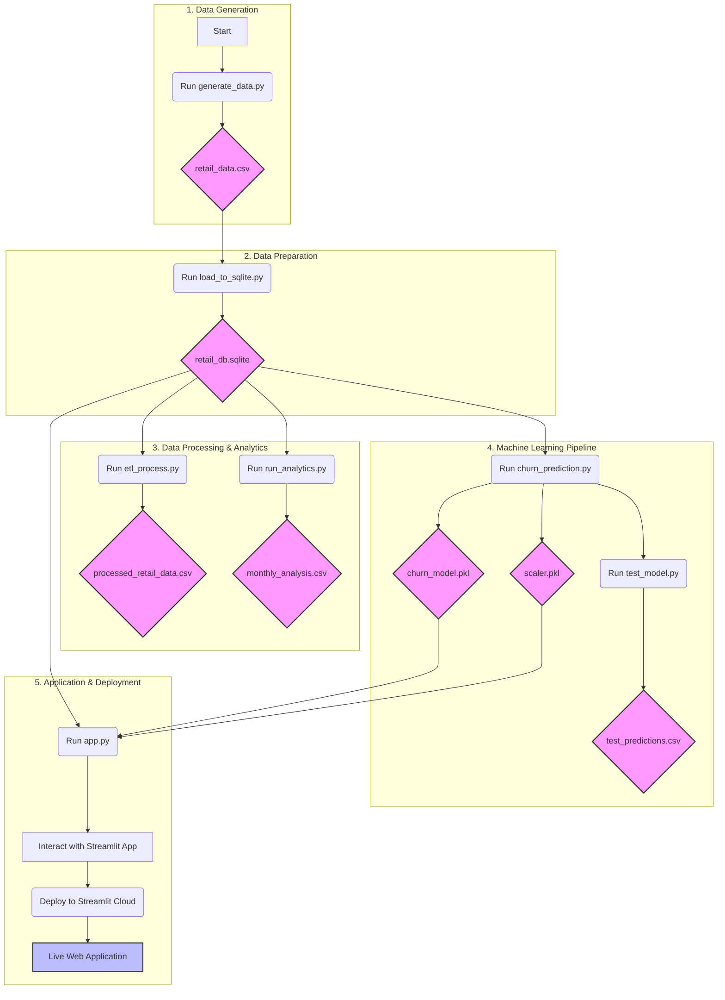

```mermaid
graph TD
    subgraph "1. Data Generation"
        A[Start] --> B(Run generate_data.py);
        B --> C{retail_data.csv};
    end

    subgraph "2. Data Preparation"
        C --> D(Run load_to_sqlite.py);
        D --> E{retail_db.sqlite};
    end

    subgraph "3. Data Processing & Analytics"
        E --> F(Run etl_process.py);
        F --> G{processed_retail_data.csv};
        E --> H(Run run_analytics.py);
        H --> I{monthly_analysis.csv};
    end

    subgraph "4. Machine Learning Pipeline"
        E --> J(Run churn_prediction.py);
        J --> K{churn_model.pkl};
        J --> L{scaler.pkl};
        J --> M(Run test_model.py);
        M --> N{test_predictions.csv};
    end

    subgraph "5. Application & Deployment"
        E & K & L --> O(Run app.py);
        O --> P[Interact with Streamlit App];
        P --> Q(Deploy to Streamlit Cloud);
        Q --> R[Live Web Application];
    end

    style C fill:#f9f,stroke:#333,stroke-width:2px
    style E fill:#f9f,stroke:#333,stroke-width:2px
    style G fill:#f9f,stroke:#333,stroke-width:2px
    style I fill:#f9f,stroke:#333,stroke-width:2px
    style K fill:#f9f,stroke:#333,stroke-width:2px
    style L fill:#f9f,stroke:#333,stroke-width:2px
    style N fill:#f9f,stroke:#333,stroke-width:2px
    style R fill:#bbf,stroke:#333,stroke-width:2px
```