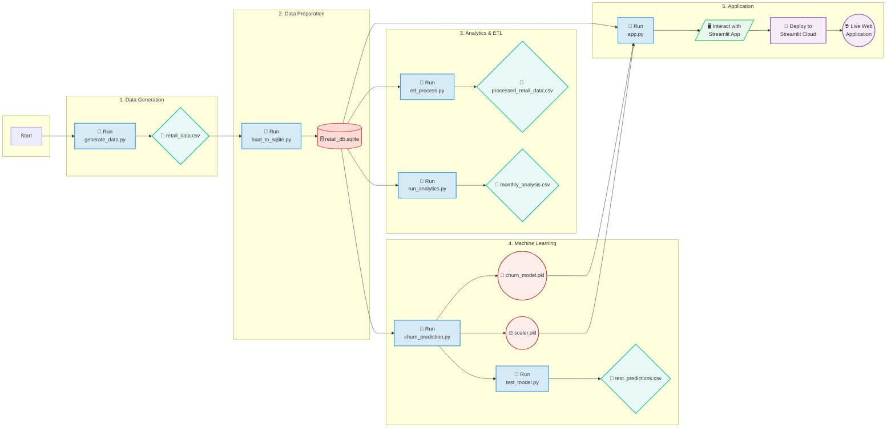

```mermaid
graph LR
    subgraph " "
        direction LR
        A[Start]
    end

    subgraph "1. Data Generation"
        direction LR
        B["
        📜 Run 
        generate_data.py"]
        C{"
        📄 retail_data.csv"}
    end

    subgraph "2. Data Preparation"
        direction LR
        D["
        📜 Run 
        load_to_sqlite.py"]
        E[("
        🗄️ retail_db.sqlite")]
    end

    subgraph "3. Analytics & ETL"
        direction TB
        F["
        📜 Run 
        etl_process.py"]
        G{"
        📄 processed_retail_data.csv"}
        H["
        📜 Run 
        run_analytics.py"]
        I{"
        📄 monthly_analysis.csv"}
    end

    subgraph "4. Machine Learning"
        direction TB
        J["
        📜 Run 
        churn_prediction.py"]
        K(("
        🤖 churn_model.pkl"))
        L(("
        ⚖️ scaler.pkl"))
        M["
        📜 Run 
        test_model.py"]
        N{"
        📄 test_predictions.csv"}
    end

    subgraph "5. Application"
        direction LR
        O["
        📜 Run 
        app.py"]
        P[/
        🖥️ Interact with 
        Streamlit App/]
        Q[
        🚀 Deploy to 
        Streamlit Cloud]
        R((
        🌐 Live Web 
        Application))
    end

    A --> B
    B --> C
    C --> D
    D --> E
    E --> F
    F --> G
    E --> H
    H --> I
    E --> J
    J --> K
    J --> L
    J --> M
    M --> N
    E & K & L --> O
    O --> P
    P --> Q
    Q --> R

    classDef script fill:#D6EAF8,stroke:#3498DB,stroke-width:2px;
    classDef data fill:#E8F8F5,stroke:#1ABC9C,stroke-width:2px;
    classDef db fill:#FADBD8,stroke:#E74C3C,stroke-width:2px;
    classDef model fill:#FDEDEC,stroke:#C0392B,stroke-width:2px;
    classDef app fill:#E9F7EF,stroke:#2ECC71,stroke-width:2px;
    classDef deploy fill:#F4ECF7,stroke:#8E44AD,stroke-width:2px;

    class B,D,F,H,J,M,O script;
    class C,G,I,N data;
    class E db;
    class K,L model;
    class P app;
    class Q,R deploy;
```