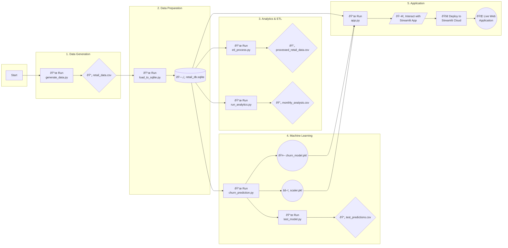

```mermaid
graph LR
    subgraph " "
        direction LR
        A[Start]
    end

    subgraph "1. Data Generation"
        direction LR
        B["
        📜 Run 
        generate_data.py"]
        C{"
        📄 retail_data.csv"}
    end

    subgraph "2. Data Preparation"
        direction LR
        D["
        📜 Run 
        load_to_sqlite.py"]
        E[("
        ðŸ—„ï¸ retail_db.sqlite")]
    end

    subgraph "3. Analytics & ETL"
        direction TB
        F["
        📜 Run 
        etl_process.py"]
        G{"
        📄 processed_retail_data.csv"}
        H["
        📜 Run 
        run_analytics.py"]
        I{"
        📄 monthly_analysis.csv"}
    end

    subgraph "4. Machine Learning"
        direction TB
        J["
        📜 Run 
        churn_prediction.py"]
        K(("
        🤖 churn_model.pkl"))
        L(("
        âš–ï¸ scaler.pkl"))
        M["
        📜 Run 
        test_model.py"]
        N{"
        📄 test_predictions.csv"}
    end

    subgraph "5. Application"
        direction LR
        O["
        📜 Run 
        app.py"]
        P[/
        ðŸ–¥ï¸ Interact with 
        Streamlit App/]
        Q[
        🚀 Deploy to 
        Streamlit Cloud]
        R((
        🌠Live Web 
        Application))
    end

    A --> B
    B --> C
    C --> D
    D --> E
    E --> F
    F --> G
    E --> H
    H --> I
    E --> J
    J --> K
    J --> L
    J --> M
    M --> N
    E & K & L --> O
    O --> P
    P --> Q
    Q --> R
```